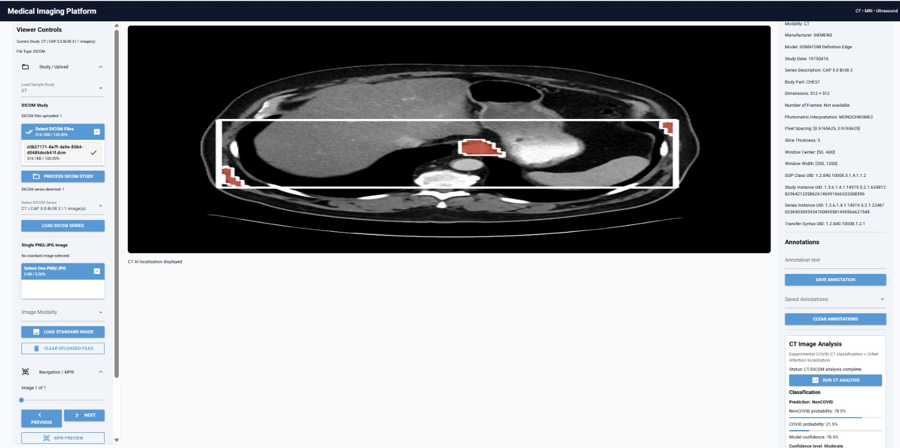
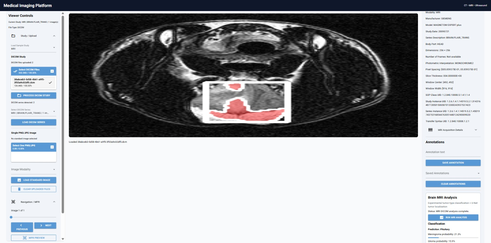
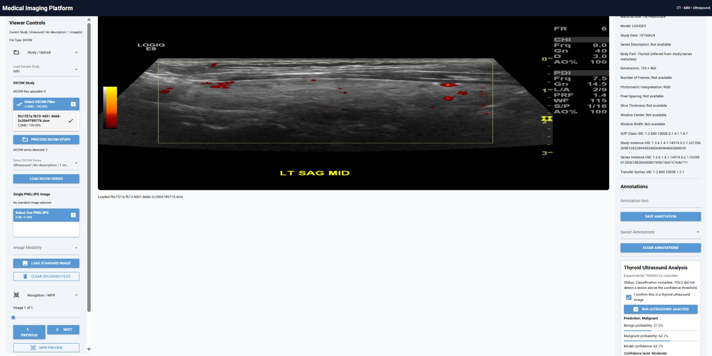

# Medical Imaging Platform

A multi-modality medical imaging platform built with Python and NiceGUI for viewing, processing, and analyzing medical images.

The platform supports **CT, MRI, and Ultrasound DICOM imaging** and integrates modality-specific machine-learning workflows for image classification and lesion localization.

> **Important:** This project is intended for research, education, and portfolio demonstration only. It is not a medical device and must not be used for clinical diagnosis or treatment decisions.

---

## Overview

The Medical Imaging Platform provides a single interface for working with multiple medical imaging modalities.

The platform currently supports:

- CT DICOM studies
- MRI DICOM studies
- Thyroid Ultrasound DICOM studies
- Standard PNG/JPG images
- DICOM metadata extraction
- DICOM series detection
- Image navigation
- CT image analysis
- MRI image analysis
- Thyroid ultrasound classification
- Lesion localization
- Visualization overlays
- Image annotations

The goal of the project is to demonstrate how medical image viewing, DICOM processing, machine-learning inference, and visualization can be integrated into one application.

---

## Platform Interface

The application is organized into three main areas.

### Viewer Controls

The left panel provides controls for:

- Uploading DICOM studies
- Selecting DICOM files
- Detecting DICOM series
- Loading a selected series
- Loading standard PNG/JPG images
- Selecting the image modality
- Navigating between images
- MPR preview
- Image viewing tools
- Measurement and analysis controls

### Medical Image Viewer

The center panel displays the currently selected medical image.

Depending on the modality and analysis workflow, the viewer can also display predicted localization overlays.

### Metadata and Analysis

The right panel displays:

- Safe DICOM metadata
- Image annotations
- Modality-specific analysis controls
- Classification results
- Model confidence
- Localization results

---

# Supported Modalities

## CT

The CT workflow supports DICOM image loading, metadata extraction, image classification, and predicted localization visualization.

The CT analysis workflow includes:

- CT DICOM loading
- DICOM metadata extraction
- Image preprocessing
- Classification
- Localization
- Visualization of predicted regions

---

## MRI

The MRI workflow supports brain MRI DICOM studies.

The MRI analysis workflow includes:

- MRI DICOM loading
- MRI metadata extraction
- Image preprocessing
- Brain MRI classification
- Predicted tumor localization
- Visualization of localization results

---

## Ultrasound

The ultrasound workflow currently focuses on **thyroid ultrasound imaging**.

The workflow includes:

- Ultrasound DICOM loading
- Thyroid anatomy validation
- DICOM-to-model preprocessing
- Benign/malignant classification
- YOLO-based lesion localization
- Bounding-box visualization
- Detection confidence
- Predicted lesion coverage

The ultrasound analysis is intentionally restricted to thyroid ultrasound images supported by the experimental models.

---

# DICOM Support

The platform can process DICOM medical images and extract non-sensitive imaging metadata for display.

Displayed metadata can include:

- Modality
- Manufacturer
- Scanner model
- Study date
- Series description
- Body part
- Image dimensions
- Number of frames
- Photometric interpretation
- Pixel spacing
- Slice thickness
- Window center
- Window width
- SOP Class UID
- Study Instance UID
- Series Instance UID
- Transfer Syntax UID

The application also handles modality-specific DICOM preprocessing before images are passed to the analysis models.

---

# Image Analysis Pipeline

The general analysis workflow is:

```text
DICOM Study
     |
     v
DICOM Parsing
     |
     v
Metadata Extraction
     |
     v
Image / Frame Selection
     |
     v
Image Preprocessing
     |
     v
Modality Validation
     |
     v
Machine-Learning Model
     |
     +--------------------+
     |                    |
     v                    v
Classification       Localization
     |                    |
     +----------+---------+
                |
                v
        Visualization
                |
                v
      Medical Image Viewer
```

Each modality uses its own analysis pipeline and model requirements.

---

# CT Analysis

The CT workflow combines image classification with localization.

The platform first processes the selected CT DICOM image and prepares it for model inference.

The resulting analysis can include:

- Predicted class
- Class probabilities
- Model confidence
- Localization overlay
- Predicted region visualization

## CT DICOM Result

The example below shows a CT DICOM study loaded into the platform with analysis results and predicted localization displayed in the viewer.



---

# Brain MRI Analysis

The MRI workflow is designed for supported brain MRI images.

The pipeline performs preprocessing followed by experimental classification and localization.

The interface can display:

- Predicted MRI class
- Class probabilities
- Model confidence
- Predicted localization
- Visualization overlay

## MRI DICOM Result

The example below shows a brain MRI DICOM study with classification and predicted localization visualization.



---

# Thyroid Ultrasound Analysis

The ultrasound pipeline combines classification with YOLO-based lesion localization.

Before analysis, the application verifies that the image is being used within the supported thyroid ultrasound workflow.

The analysis pipeline is:

```text
Thyroid Ultrasound DICOM
          |
          v
DICOM Validation
          |
          v
DICOM Image Conversion
          |
          +-----------------------+
          |                       |
          v                       v
 TN5000 Classifier        YOLO Localizer
          |                       |
          v                       v
 Benign / Malignant       Lesion Detection
          |                       |
          +-----------+-----------+
                      |
                      v
              Viewer Overlay
```

The classifier reports:

- Benign probability
- Malignant probability
- Model confidence
- Confidence level

The localization component reports:

- Whether a lesion was detected
- YOLO detection confidence
- Bounding-box coordinates
- Predicted lesion coverage
- Number of detections

## Ultrasound DICOM Result

The example below shows a thyroid ultrasound DICOM study processed through the platform.



---

# DICOM Series Handling

A DICOM upload can contain multiple images or series.

The platform identifies available series and allows the user to select and load the desired series.

The workflow is:

```text
Upload DICOM Files
        |
        v
Process DICOM Study
        |
        v
Detect DICOM Series
        |
        v
Select Series
        |
        v
Load DICOM Series
        |
        v
Navigate Images
```

This allows the viewer to work with medical imaging studies rather than treating every DICOM file as an unrelated image.

---

# Image Navigation

For studies containing multiple images, the application provides image navigation controls.

Available controls include:

- Previous image
- Next image
- Image slider
- Current image index
- MPR preview controls

---

# Annotations

The platform includes an annotation section for recording notes associated with the current viewing workflow.

Users can:

- Enter annotation text
- Save annotations
- View saved annotations
- Clear annotations

The annotation feature is intended for research and demonstration purposes.

---

# Model Architecture

The platform uses separate models for different imaging tasks rather than applying one model to every modality.

Conceptually:

```text
Medical Image
      |
      v
Modality Detection
      |
      +-------------------+-------------------+
      |                   |                   |
      v                   v                   v
     CT                  MRI             Ultrasound
      |                   |                   |
      v                   v                   v
CT Models            MRI Models       Thyroid Models
      |                   |                   |
      v                   v                   v
Classification       Classification     Classification
Localization         Localization       YOLO Localization
```

This keeps modality-specific preprocessing and inference separated.

---

# Ultrasound YOLO Localization

The thyroid ultrasound localization workflow uses a YOLO detector trained for experimental thyroid lesion localization.

When a detection is produced, the application obtains:

```text
Detection confidence
Bounding-box X coordinate
Bounding-box Y coordinate
Bounding-box width
Bounding-box height
Predicted lesion coverage
Number of detections
```

The predicted region is then mapped back onto the ultrasound image for visualization.

---

# Grad-CAM Support

The project also contains Grad-CAM functionality for visualizing model attention in supported classification workflows.

Grad-CAM can help inspect which image regions contribute to a model's prediction.

This feature is intended for model interpretation and research rather than clinical explanation.

---

# Project Structure

```text
Medical_Imaging_Platform/
│
├── app.py
│
├── README.md
│
├── requirements.txt
│
├── .gitignore
│
├── ai/
│   ├── gradcam.py
│   ├── ultrasound_classifier.py
│   └── ...
│
├── models/
│   ├── ct/
│   ├── mri/
│   └── ultrasound/
│
├── training/
│   ├── ct_segmentation/
│   ├── mri_segmentation/
│   ├── ultrasound_segmentation/
│   ├── test_ct_dicom_analysis.py
│   ├── test_dicom_ai_bridge.py
│   ├── test_mri_dicom_analysis.py
│   └── test_mri_dicom_bridge.py
│
└── docs/
    └── images/
        ├── ct_dicom_result.jpg
        ├── mri_dicom_result.jpg
        └── ultrasound_dicom_result.jpg
```

Generated training outputs, evaluation results, and temporary experiment files are excluded from version control where appropriate.

---

# Training and Evaluation

The repository contains scripts used to develop and evaluate the modality-specific localization workflows.

## CT

CT training utilities include scripts for:

- Preparing segmentation data
- Training segmentation models
- Evaluating models
- Testing localization

## MRI

MRI training utilities include scripts for:

- Preparing MRI segmentation datasets
- Training MRI segmentation models
- Evaluating localization
- Testing platform compatibility

## Ultrasound

Ultrasound training utilities include scripts for:

- Preparing thyroid localization data
- Training localization models
- Evaluating YOLO models
- Testing ultrasound localization

These scripts are separated from the main application so that model development and application inference remain organized independently.

---

# Technologies

The project uses technologies including:

- Python
- NiceGUI
- NumPy
- Pillow
- pydicom
- TensorFlow / Keras
- Ultralytics YOLO
- OpenCV
- DICOM image processing
- Image segmentation
- Image classification
- Object localization
- Grad-CAM

---

# Running the Application

Create and activate a Python virtual environment.

### Windows PowerShell

```powershell
python -m venv .venv
.venv\Scripts\Activate.ps1
```

Install the required packages:

```powershell
pip install -r requirements.txt
```

Start the application:

```powershell
python app.py
```

The NiceGUI application will start locally.

Open the local address displayed in the terminal, typically:

```text
http://localhost:8090
```

---

# Typical Workflow

A typical DICOM workflow is:

1. Start the application.
2. Select CT, MRI, or Ultrasound.
3. Upload the DICOM files.
4. Process the DICOM study.
5. Select the detected series.
6. Load the DICOM series.
7. Navigate to the desired image.
8. Review the safe metadata.
9. Run the supported modality analysis.
10. Review the classification and localization results.

For thyroid ultrasound analysis, confirm that the selected image belongs to the supported thyroid ultrasound workflow before running the model.

---

# Safety and Intended Use

This software is an experimental research and portfolio project.

It is **not intended for clinical use**.

The predictions, classifications, segmentation masks, localization boxes, probabilities, confidence scores, and visualization overlays produced by this software must not be interpreted as medical diagnoses.

The project has not been validated as a medical device and has not undergone regulatory review for clinical deployment.

---

# Current Capabilities

The current version demonstrates an end-to-end workflow combining:

- Multi-modality DICOM viewing
- CT, MRI, and ultrasound support
- DICOM series handling
- Metadata extraction
- Image navigation
- Modality-specific preprocessing
- Image classification
- Lesion localization
- YOLO-based thyroid localization
- Visualization overlays
- Grad-CAM support
- Training and evaluation utilities
- Research-oriented annotations

---

# Future Improvements

Potential future development includes:

- Improved DICOM series management
- Better multi-frame DICOM support
- Improved image windowing controls
- Expanded MPR visualization
- Additional modality-specific models
- Improved segmentation visualization
- Quantitative lesion measurements
- Model performance dashboards
- Automated testing
- Improved deployment support
- More extensive validation datasets

---

# Disclaimer

This repository is intended solely for **educational, research, software-development, and portfolio demonstration purposes**.

It is not intended to diagnose, prevent, monitor, predict, prognose, treat, or alleviate disease.

Any model output shown by the application should be considered experimental.

---

## Project Status

**Active Development**

Current supported imaging workflows:

**CT | Brain MRI | Thyroid Ultrasound**